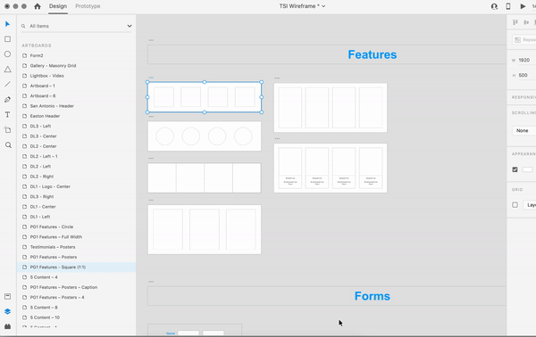

# notes-plugin-xd
A Notes plugin for adding basic notation functionality to Adobe XD

How to use:
1 - Select Artboard or Group
2 - Select Notes Plugin and create notes by clicking Notes > Create Note Fields
3 - View notes by selecting Notes > Note Panel
4 - Save note by clicking Save Changes

This creates notes by adding hidden Text Boxes to the artboard or group which can then be viewed from the panel view.

To Do:
- Add visual indicator for Artboards or Groups with notes.
- Add prompt for creating additional/custom-titled notes.
- Receive feedback from other designers.
